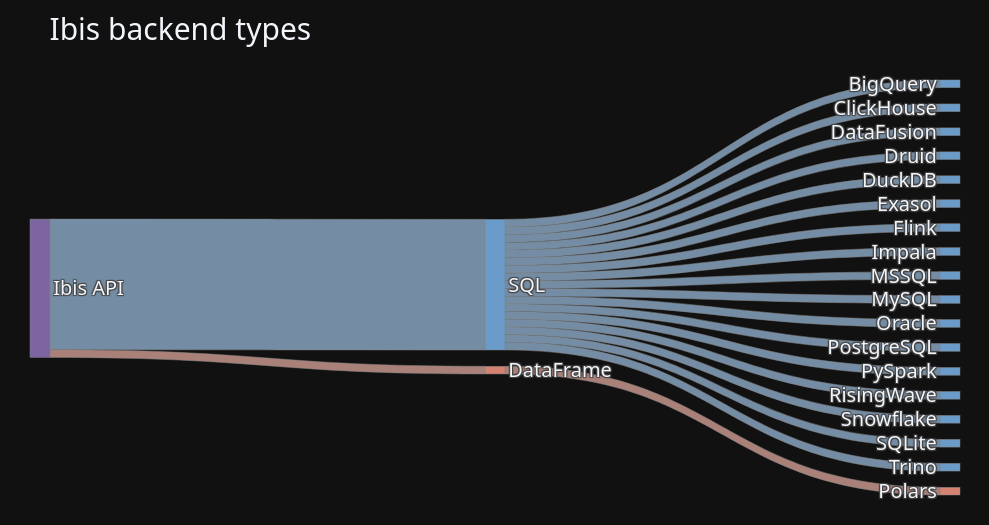

## Learning Objectives

By the end of this chapter, you will be able to:

- Connect Ibis to multiple backend systems
- Write backend-agnostic queries
- Understand backend-specific capabilities and limitations
- Configure connections for different data sources

This chapter covers how to connect Ibis to various data sources and backends,
demonstrating the flexibility of writing code once and running it on different backends.

## Connecting to Different Backends

Ibis can connect to many different backends, and the same query code works across all
of them:



Here's how to work with the World of Warcraft dataset across different backends:

```{python}
# TODO: Add backend connection examples
```

This chapter will demonstrate Ibis's key advantage: writing analysis code once and
running it on multiple backends including DuckDB, PostgreSQL, Snowflake, and others
without changing your code.

---

*This chapter is a work in progress.*
